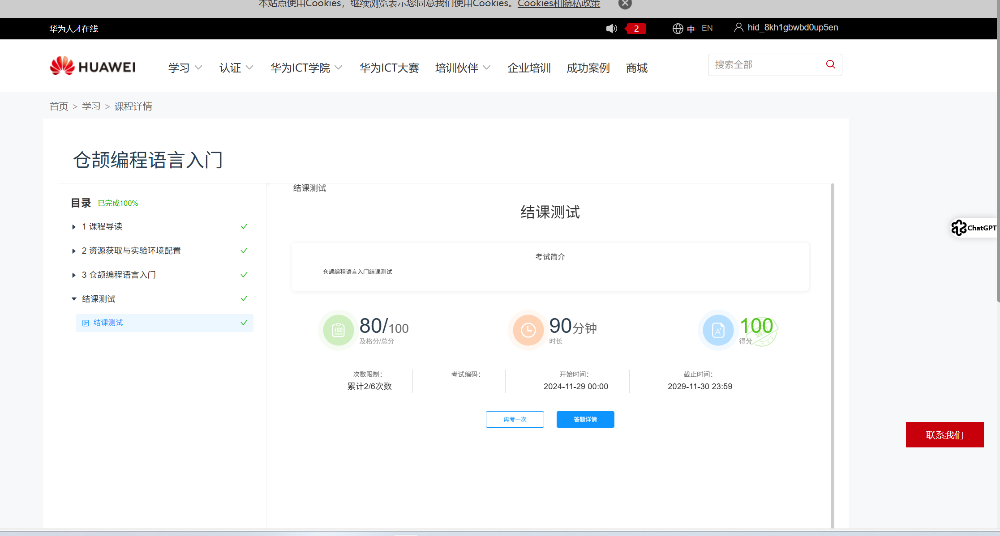
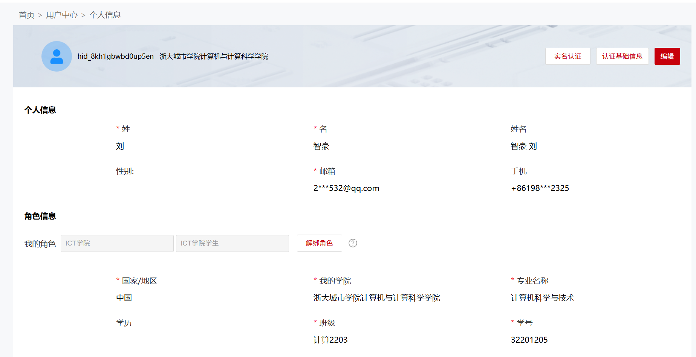

### 实 验 报 告

- 课  程  名   仓颉编程语言
- 课  程  号      C01102
- 学 生 姓  名   刘智豪
- 学 生 学 号     32201205
- 专 业 班 级     计算2203
- 所 在 学 院    计算分院
- 指 导 老 师     郭鸣

 实验报告日期：  2024  年  6 月 20 日

## 期末项目

 每个人都要提交项目报告。

内容包括代码，本说明文件

### 仓颉语言课程学习任务

此处插入考核成绩截图

- https://e.huawei.com/cn/talent/#/course/course-details?applicationId=1747048685582&courseType=ICT&invitedCode=ZnJ59J&urlForm=myclass
- 班级邀请码 **ZnJ59J**
- 课程请用实名，期末成绩统计需要

  

### 仓颉编程任务

### 代码仓库

❗ 此处填写 gitcode上你的仓库地址   https://gitcode.com/leaveWhite9088/xxxx

#### 参考项目SimpleIOC

https://gitcode.com/leaveWhite9088/simpleioc

- 有 ReadME，项目简介
- 有 doc ，设计说明
- 有 src , test ，包括测试
- 代码千行左右

## 心得体会

- xxx：你在项目中的困难，解决思路，收获，对仓颉编程语言的体会
- yyy：

  你在项目中的困难，解决思路，收获，对仓颉编程语言的体会

## 仓颉项目技术评价

| 功能/技术 | 备注           | 优 | 良 | 中 |
| --------- | -------------- | -- | -- | -- |
| 功能1     | ex(init).c     | √ |    |    |
| .。。。。 | ex(selfplus).c | √ |    |    |
| zzz       |                |    |    |    |
| 函数式    |                |    |    |    |
| 优化技术  |                |    |    |    |
| 。。。。  |                |    |    |    |
|           |                |    |    |    |

## 小组分工

- xxx

  - 工作内容
    - 文档编写
    - 测试程序
    - 结构体
- yyyy

  - 工作内容
    - 文档编写
    - 测试程序
    - 语法分析
    - 栈、堆设计
- 权重分配表：

| xxx | yyy |
| --- | --- |
| 0.9 | 0.9 |

1组人权重 最高 1.0

2人组权重 和最高 1.8

## 评分表

|       评分标准       | 总分 |                                                          说明                                                          | 自评计分 | 教师计分 |
| :------------------: | :---: | :--------------------------------------------------------------------------------------------------------------------: | -------- | -------- |
|  **代码质量**  | 30分 |                   代码结构清晰，易于理解；代码注释充足，有助于理解代码功能；代码无冗余，遵循DRY原则                   | 27       |          |
|  **功能实现**  | 40分 |                                 所有要求的功能都已实现并正确运行；程序无明显错误或bug                                 | 32       |          |
|   **创新性**   | 10分 |                                作业展示了独特的创新思维；作业中实现的功能超出了基本要求                                | 10       |          |
|  **用户体验**  | 10分 |                                     程序界面友好，易于操作；程序反馈清晰，易于理解                                     | 10       |          |
| **文档和报告** | 10分 | 提交了完整的文档，包括设计思路、代码解释和用户指南；提交了清晰的项目报告，包括项目概述、实现过程和遇到的问题及解决方案 | 10       |          |
|         总分         | 100分 |                                                                                                                        | 89       |          |

（以下请勿修改）

## 指导教师评语

优： "此份大作业表现出色，展示了深入的课程内容理解和应用。项目设计结构清晰，模块划分合理，显示出良好的软件工程素养。各项功能都能准确地识别和处理各种输入，这是非常值得赞扬的。代码实现部分也做得很好，实现了一些高级的技术。总的来说，此份作业完成得非常好，期待看到在编程项目方面的进一步成果。"

---

良： "此份大作业完成得很好，展示了对课程内容的理解和应用。项目设计结构清晰，模块划分合理。各项功能都能处理大部分的输入，这是值得赞扬的。然而，代码实现部分还有一些提升的空间。建议在未来的学习中，可以更深入地研究这些高级技术。"

---

中： "此份大作业完成得一般，展示了对课程内容的基本理解。项目设计有一定的结构，但模块划分还有待改进。各项功能能处理一部分的输入，但还有一些错误需要修正。代码实现部分还有很大的提升空间。建议在未来的学习中，加强对**编程**的理解和应用。"

---

及格： "此份大作业完成得基本合格，但还有很多需要改进的地方。项目设计需要更清晰的结构和更合理的模块划分。各项功能还有很多错误需要修正。代码实现部分几乎没有亮点。建议在未来的学习中，加强对**编程**的理解和应用，提高编程技能。"

  实验报告评分（百分制）：   分

  指导教师签名：``

  日     期：2024年6  月 20 日
